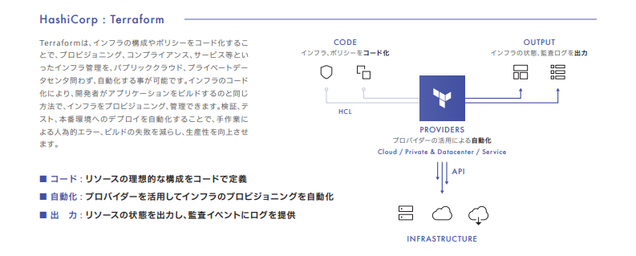

# Terraform

**[Terraform](https://developer.hashicorp.com/terraform)** とは、Infrastructure as Code（IaC）ツール。 \
インフラ（サーバー・ネットワーク・クラウドリソースなど）を`コード（.tfファイル）`で管理する。

HashiCorp社が提供している製品で、CPU、メモリ、ディスクといったインフラの構成やポリシーをコード化することで、クラウド・オンプレミス問わず、インフラ管理を自動化することが可能。　\
なお、OSSの無償版と有償版(Terraform Enterprise)がある。

> [!NOTE]
> **Infrastructure as Code(IaC)** とは、CPU、メモリといったサーバのインフラ構築を、コードを用いて自動的に行うこと。

**ー 何ができる？：**
* [AWS](https://github.com/DearJey/PublicCloud/tree/main/AWS)や[GCP](https://github.com/DearJey/PublicCloud/tree/main/GCP)など、複数クラウドのリソースをコードで「作成」「変更」「削除」できる。
* k8sクラスタ自体や、クラスタ上のリソース（Pod, Service, Deploymentなど）も管理可能。
* コードなので、変更履歴（Git管理）、自動化、再利用がカンタン。

### Terraformで何ができるの？

Terraformは、AWS, Azure, GCP, VMWareなど、様々な環境に対応している。 \
→ 異なる環境に適用できるということは、
* 異なる環境でも単一のコードで対応可能であり、使いまわしができる
* コードに基づいて検証し、デプロイするため、手順漏れや人為的ミスが防げる

つまり... \
**安全に、かつ効率的にインフラ構築ができ、生産性が向上する！** \
というメリットがある。

Terraformには、各クラウドのプロバイダ（プロビジョニング対象製品のためのプラグイン）があり、これを介してリソースを作成する。



* 「**CODE**」：インフラやポリシーをコード化して定義
* 「**HCL**」：HCL(HashiCorp Configuration Language)という独自の言語を用いる
* 「**PROVIDERS**」：各サービスやプロダクトのAPIへ変換し、プロビジョニングを自動化
* 「**OUTPUT**」：リソースの状態や監査ログを出力

### どうやってコードを作成するの？

Terraformを実行するための流れは、ざっくりと以下のようになる。

1. Terraformをインストール
2. ★定義ファイルの作成・配置
3. Terraformプロバイダを設定(init)
4. 定義ファイルに基づいて、各製品のＡＰＩに対応したコードを自動生成(plan)
5. コード適用(apply)

#### 2.定義ファイルの作成・配置について

Terraformでは、拡張子`.tfのファイル(テキストデータ)`に、リソースの定義を記述する。 \
なお、Terraformのコードは、HCLという独自の言語により記述されているため、構文には注意が必要。

例えばVMware vSphereに構築したい場合、以下のように、providerにインフラ名`vsphere`を定義する。 \
AWSの場合は、”aws”を定義し、それぞれ該当する変数を指定。

実際に作成するリソースは、resourceに定義する。 \
以下では、変数countに応じて仮想マシンの名前を001,002,…と順に付与していくような仕組みになっている。 \
また、当然ながら、CPUやメモリ等のリソースの定義も可能。

* サンプルコード：main.tf
```
provider "vsphere" {
  user                        = var.vsphere_user #vsphereのユーザー名
  password                    = var.vsphere_password #vsphereのパスワード
  vsphere_server              = var.vcenter_server #vCenterのFQDN/IPアドレス
  allow_unverified_ssl        = true #SSL証明書の検証無効
}
[省略]
#Resource
resource "vsphere_virtual_machine" "vm" {
  count                       = var.prov_vm_num #仮想マシンの数
  name                        = "${var.prov_vmname_prefix}${format("%03d",count.index+1)}"
                                #仮想マシンの名前”接頭語”+”001”
[省略]
#Resource for VM Specs
  num_cpus                    = var.prov_cpu_num #仮想マシンのCPUの数
  memory                      = var.prov_mem_num #仮想マシンのメモリのMB
※変数の定義は別途必要
```

## Terraformのメリット(k8s視点)

1. **k8sクラスタの構築・管理**
   * EKS（Elastic Kubernetes Service）を自動で作成できる。
   * ノードグループ（EC2）、VPC、ネットワーク、IAMロールなど、手作業だと面倒な設定も一括コード化。
  
2. **マニフェスト管理との違い**
   * k8sの`kubectl apply`やHelmは「k8sリソース（Pod, Service）」の管理が中心。
   * Terraformは「クラウドインフラ（EKSクラスタ、EC2、ネットワーク）」＋「k8sリソース」両方管理できる。
     * たとえば「EKSクラスタをつくる」→「その上でPod, Serviceをデプロイする」まで一気通貫でコード化可能。
    
## テラフォームとKubernetesの違いは?

AWS公式サイト：https://aws.amazon.com/jp/compare/the-difference-between-terraform-and-kubernetes/

* **Terraform**: インフラをコードで定義・管理する「Infrastructure as Code (IaC)」ツール。クラウドリソースの作成・管理・プロビジョニングを自動化する。
* **Kubernetes**: コンテナの運用・管理を自動化する「コンテナオーケストレーション」ツール。コンテナのスケジューリングやグループ化、スケールなどを担当する。

→　TerraformはクラウドなどのITインフラ全体の構築・管理、Kubernetesはコンテナ化されたアプリケーションの運用・管理に特化している。

### なぜKubernetes と Terraformが使われているのか?

* **Terraform**： \
  複雑で多様なインフラを、**コードで自動的に**構築・管理するためのツール。
  * インフラの再現性・透明性・効率性を実現
  * 手動プロビジョニングの手間やミスを減らし、様々な環境や変更に柔軟に対応できる

* **Kubernetes**: \
  多数のコンテナやマイクロサービスで構成される現代的なアプリケーションを、大規模かつ効率的に運用管理するためのツール。
  * コンテナの調整・スケジューリング・グループ化を自動化
  * 複雑な運用を効率化し、どこでも同じ運用体制でアプリを展開できる。

### 仕組み:テラフォームと Kubernetes の比較

* **Terraform**：
  * インフラの構成と現状を「状態ファイル」で管理。
  * 希望する構成と現状を比較し、必要な変更（追加・修正・削除）を計画する。
  * その計画に基づき、各クラウドやサービスへインフラの作成・プロビジョニングを自動で実行。

* **Kubernetes**：
  * サーバー群（クラスター）上でコンテナを効率的に管理・スケジューリングする仕組み。
  * コンテナは「ポッド」としてグループ化され、必要に応じてスケールできる。
  * コントロールプレーンがリソース状況や定義に基づき、ポッドの配置・スケール・トラフィック管理などを自動化。

### テラフォームとクベルネテスの類似点は?

* **宣言型構成**： \
  どちらも、望ましいシステム状態を宣言的に定義し、ツールが自動でその状態に到達するよう管理する。
* **自動変更管理**： \
  構成変更や依存関係を自動で検出・適用し、エラーを減らしながら継続的なインテグレーションやデプロイをサポートする。
* **マルチクラウド対応**： \
  複数のクラウドやオンプレミス環境で利用でき、クラウドに依存しない運用が可能。
* **コミュニティの支援**： \
  オープンソースかつ多くの開発者コミュニティによるサポートや拡張機能が充実している。

### 主な相違点:テラフォームと Kubernetes の比較

1. **プロビジョニング範囲**
   * Terraform：クラウド全体のインフラ（仮想マシン、ネットワーク、ストレージなど）を管理
   * Kubernetesはコンテナワークロード専用のインフラを管理

2. **抽象化レベル**
   * Terraform：より高い抽象化でクラウドリソース全体を扱う
   * Kubernetesはより低い抽象化でコンテナの配置や運用に特化している。

3. **設定言語**
   * Terraform：HCL（HashiCorp Configuration Language）を使用
   * KubernetesはYAMLやJSON形式のマニフェストファイルを使う。

4. **障害復旧**
   * Terraform：自動で障害を検出・回復する仕組みはなく、手動スクリプトや追加ツールが必要
   * Kubernetesは障害発生時にコンテナを自動で再起動・復旧する。

5. **使いやすさ**
   * Terraformは初心者でも使いやすく、セットアップも簡単。
   * Kubernetesは習得やセットアップに高度な知識と手順が必要で、より複雑。

### いつ使うべきか:テラフォームと Kubernetes の比較

* **Terraform**：
  * 頻繁なスケールアップ/ダウンが必要な多層アプリのインフラ構築・管理に最適
  * テンプレートを使い、迅速に環境をセットアップできる
  * ネットワーク機器（ファイアウォールやルーター）などのクラウドインフラにも利用
  * 一時的な環境の作成・破棄も簡単

* **Kubernetes**：
  * コンテナ化されたアプリケーションの大規模運用・管理に最適
  * 開発環境から本番環境までシームレスに移行可能
  * オンプレミスやクラウド（例：AWS）で高可用性・スケーラブルな運用ができる

## 相違点の要約

| | **テラフォーム** | **Kubernetes** |
| --- | --- | --- |
| **内容** | コードとしてのIaCツール | コンテナオーケストレーションツール |
| **利用理由** | 管理対象インフラストラクチャに再現性、透明性、効率性をもたらすこと |運用の複雑さを軽減して、コンテナワークロードとマルチコンテナアプリケーションを拡張できるようにするため |
| **リソース管理** | コンピュートインスタンス、ストレージ、ネットワークなど、あらゆる種類のインフラストラクチャオブジェクトを管理 | サーバーリソースをコンテナワークロードの Kubernetes クラスターとしてのみ管理 |
| **抽象化** | 複数のクラウド環境にわたるインフラストラクチャのプロビジョニングを抽象化 | サーバー・プロビジョニングを単一クラスター内で抽象化 |
| **設定言語** | HCL | YAML または JSON |
| **障害復旧** | 障害回復を管理するには、ツールとスクリプトを使用する必要がある | 自動化と自己管理 |
| **使いやすさ** | 学習曲線が短く、簡単に始められる | 始める前に、コンテナ化の原則、ネットワーク、負荷分散、スケーリング戦略に関する知識が必要 |

## 参考

* Terraform連載 第1回：いまさら聞けない、IaCってなに？～Terraform、IaSQLの紹介～：https://www.ntt-tx.co.jp/column/iac/230815/

* クラウドインフラの自動化(PDF)：https://www.networld.co.jp/product_file/file/Terraform.pdf
